# Báo cáo kết quả Lab & Challenge W10 - Security & Hardening Platform

## Phần trả lời câu hỏi lý thuyết (Slide W10)

### 1. Vì sao các guardrail cũ tự động áp dụng cho namespace/team mới (Team B - payments) mà không cần viết luật mới?
* **Cấp độ hoạt động (Scope):** Các chính sách của OPA Gatekeeper (Constraints) và Sigstore Policy Controller (ClusterImagePolicy) được định nghĩa ở cấp độ **Cluster (Cluster-scoped)**. 
* **Cơ chế khớp luật (Matching rules):** Khi định nghĩa Constraint, ta chỉ định loại tài nguyên cần kiểm tra (ví dụ: mọi `Deployment`, `Pod` trong cụm) chứ không giới hạn theo namespace cụ thể. Do đó, khi một namespace mới như `payments` được tạo ra, bất kỳ yêu cầu tạo Pod/Deployment nào gửi tới Kubernetes API Server đều phải đi qua Admission Webhook của Gatekeeper và Sigstore. Nhờ vậy, các guardrail bảo mật (chặn tag `:latest`, bắt buộc `limits`, chặn `runAsUser: 0`, xác thực chữ ký image) tự động được thực thi trên namespace mới mà không cần nhân bản hay cấu hình lại.

### 2. Sự khác biệt giữa Role/RoleBinding và ClusterRoleBinding trong việc giữ cô lập (Multi-tenancy)?
* **Role / RoleBinding (Namespace-scoped):** Định nghĩa và liên kết quyền **chỉ có hiệu lực bên trong một Namespace cụ thể**. Khi gán quyền cho `payments-developer` bằng RoleBinding trong namespace `payments`, tài khoản này hoàn toàn không thể xem hoặc can thiệp sang namespace `demo` hay `kube-system`. Đây là chìa khóa để triển khai Multi-tenancy an toàn.
* **ClusterRoleBinding (Cluster-scoped):** Liên kết một Role/ClusterRole với đối tượng trên phạm vi **toàn bộ Cluster**. Nếu ta dùng ClusterRoleBinding cho `payments-developer`, họ sẽ có quyền thao tác trên toàn bộ namespaces của cụm (bao gồm cả `demo` và `kube-system`), phá vỡ hoàn toàn ranh giới cô lập giữa các team.

---

## Phần 1: Chứng minh Lab 1 - RBAC & Admission Policy (Gatekeeper)

### 1.1. Phân quyền Role-Based Access Control (RBAC)
Hệ thống phân quyền chi tiết cho 3 đối tượng `alice` (Developer), `bob` (SRE), và `carol` (Viewer) đã được sync qua GitOps thành công.
*   **Alice** (Developer ns `demo`): Có quyền CRUD workload trong namespace `demo`, không thể đụng vào namespace khác.
    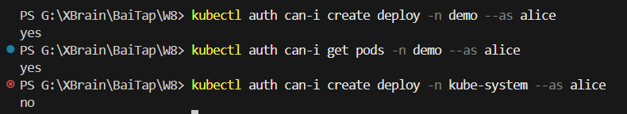
*   **Bob** (SRE toàn cụm): Được xem và thao tác trên Pod ở mọi namespace.
    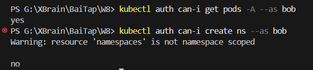
*   **Carol** (Viewer toàn cụm): Chỉ có quyền đọc (Read-only), không được phép chỉnh sửa hay xóa.
    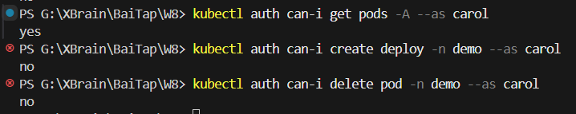

### 1.2. Gatekeeper Constraints - Chặn manifest vi phạm
4 chính sách bảo mật bắt buộc đã hoạt động chính xác tại Admission Control:
*   **Cấm image tag `:latest`**: Tránh deploy các phiên bản không xác định.
    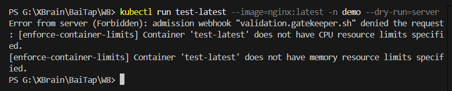
*   **Bắt buộc có resource limits**: Tránh Pod chiếm dụng hết tài nguyên của Node.
    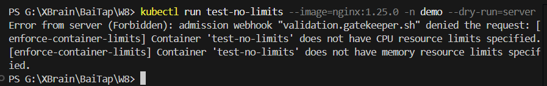
*   **Cấm chạy container bằng quyền root (`runAsUser: 0`)**: Hạn chế leo thang đặc quyền.
    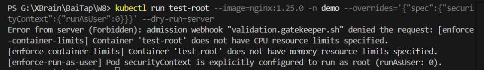
*   **Cấm sử dụng `hostNetwork: true`**: Tránh container can thiệp trực tiếp vào mạng vật lý của Node.
    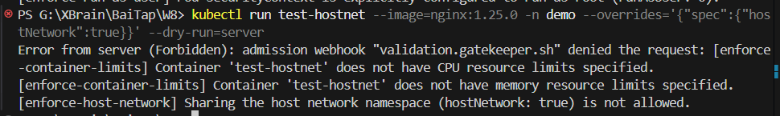

### 1.3. Custom ConstraintTemplate (Bắt buộc)
Đã tự định nghĩa chính sách bắt buộc mọi Deployment/Pod phải có nhãn `owner` để phục vụ audit/chargeback:
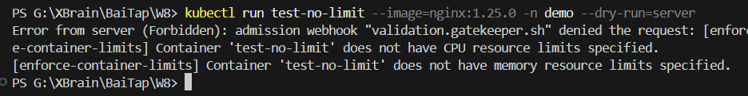

---

## Phần 2: Chứng minh Lab 2 - Secrets & Supply Chain Hardening

### 2.1. Quản lý Secret tự động với External Secrets Operator (ESO)
Mật khẩu cơ sở dữ liệu được quản lý tập trung trên AWS Secrets Manager và đồng bộ tự động về cụm.
*   **Thời gian đồng bộ (Refresh Interval) < 60s**: Đổi mật khẩu trên AWS, K8s Secret tự động cập nhật giá trị mới.
    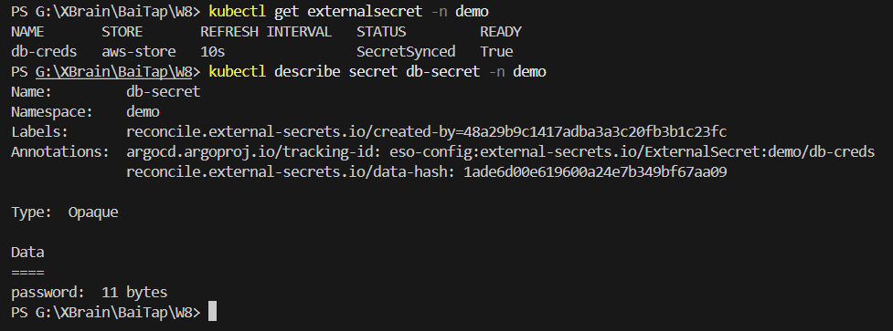
*   **Không cần restart Pod (Zero-Downtime)**: Nhờ mount Secret dưới dạng volume, Pod tự động đọc được file mật khẩu mới mà không cần khởi động lại Pod.
    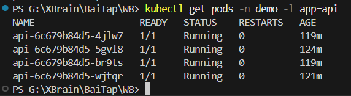

### 2.2. Kiểm tra lỗ hổng bảo mật (Trivy Scan trong CI)
Mọi Pull Request/Push lên nhánh chính đều kích hoạt bước quét mã nguồn và ảnh container bằng Trivy. Nếu phát hiện lỗ hổng `HIGH` hoặc `CRITICAL`, pipeline sẽ tự động báo đỏ và chặn merge.
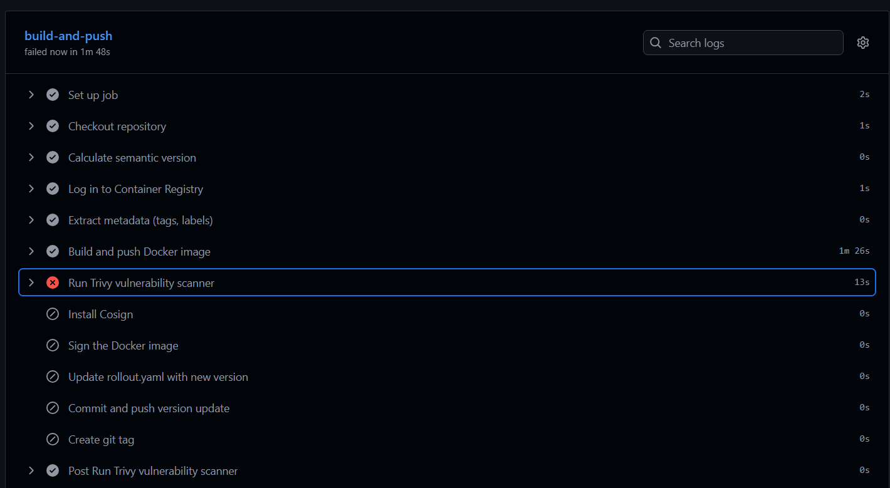

### 2.3. Ký số & Xác thực ảnh container (Cosign + Sigstore)
*   **CI ký số ảnh**: Ảnh container sau khi scan sạch sẽ được ký bằng khóa riêng tư của Cosign.
*   **Verify tại Admission Control**: Sigstore Policy Controller chỉ cho phép deploy các ảnh có chữ ký hợp lệ.
*   **Deploy ảnh chưa ký**: Bị admission webhook reject lập tức.
    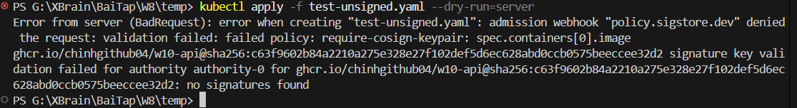
*   **Deploy ảnh đã ký**: Khớp chính sách và chạy thành công.
    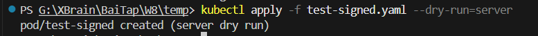

---

## Phần 3: Chứng minh Challenge 24h - Onboard Team Payments & Cô lập Tenant

### 3.1. Phân quyền Least-Privilege cho Developer Team Payments
Tài khoản `payments-dev` được giới hạn nghiêm ngặt chỉ quản lý workload trong namespace `payments`:
*   Cho phép CRUD workloads (deployment, pod, service, rollout) trong `payments`.
*   Chặn hoàn toàn hành vi can thiệp sang namespace `demo` hoặc đọc secrets/sửa quyền.
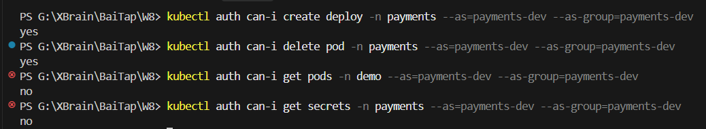

### 3.2. Kiểm soát ngân sách tài nguyên (ResourceQuota & LimitRange)
*   **ResourceQuota**: Ngăn chặn tình trạng team `payments` deploy vượt quá giới hạn tổng của namespace.
    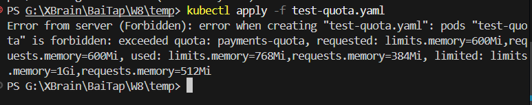
*   **LimitRange**: Tự động điền các thông số CPU/Memory mặc định cho các Pod không khai báo tài nguyên, giúp vượt qua Gatekeeper thành công.
    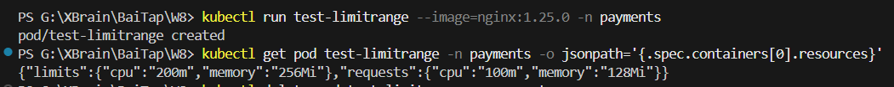

### 3.3. Tường lửa mạng cô lập Tenant (NetworkPolicy)
Áp dụng chính sách mạng chặn tuyệt đối luồng giao tiếp giữa 2 tenant:
*   **Chặn kết nối chéo**: Pod từ namespace `payments` cố gắng kết nối tới service `api` ở namespace `demo` sẽ bị Timeout hoàn toàn.
    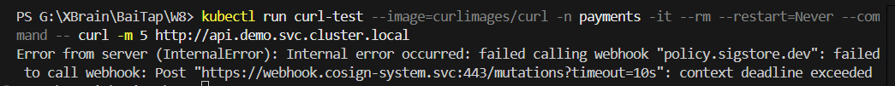
*   **Phân giải DNS và truy cập bên ngoài**: Pod vẫn có thể phân giải tên miền nội bộ và truy cập internet bình thường.
    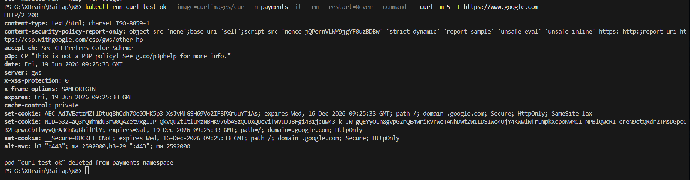